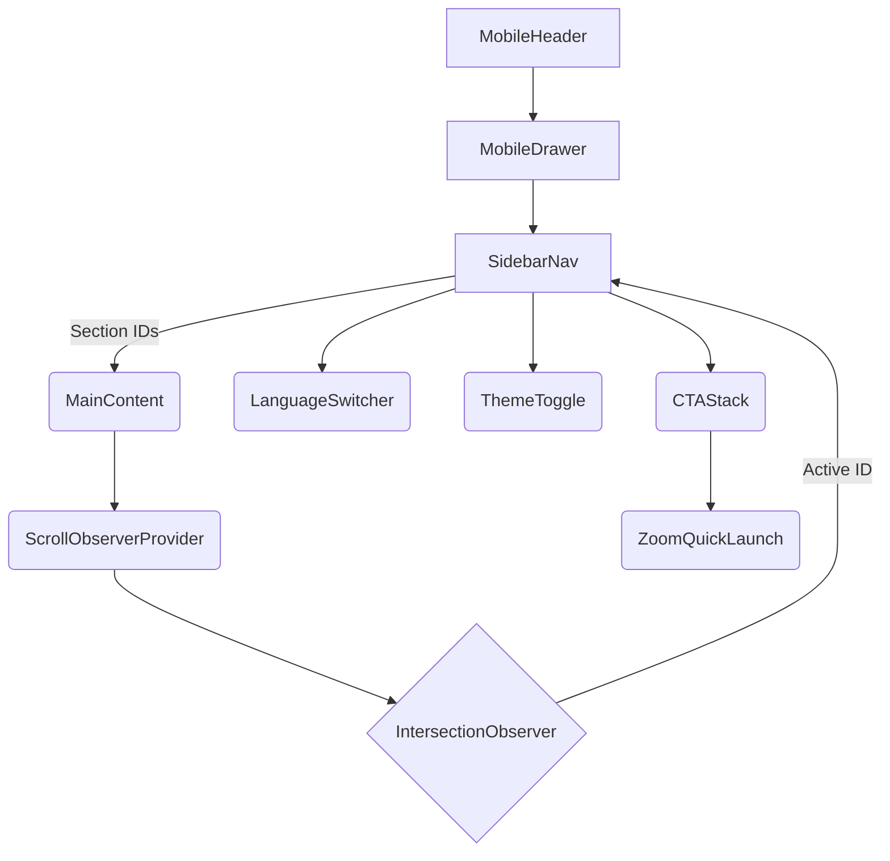

# Layout & Navigation Plan

## Objectives
- Implement a left sidebar navigation that remains accessible and performant across breakpoints, with mobile drawer parity.
- Ensure main content uses SPA-like smooth scrolling with active section highlighting via IntersectionObserver while respecting RSC boundaries.
- Integrate theme switching, language selection, and CTA elements into sidebar/drawer with proper accessibility and focus handling.
- Maintain strict color usage and spacing tokens aligned with Tailwind configuration.

## 1. Page Shell Composition
```
app/[locale]/layout.tsx
└─ <html lang>
   └─ <body>
      ├─ <Providers> (ThemeProvider, NextIntlProvider, ConsentProvider)
      └─ <AppShell locale>
         ├─ <Sidebar /> (desktop ≥ lg via CSS grid/flex)
         ├─ <MobileHeader /> (<= md; contains hamburger + brand)
         └─ <MainContent /> (scrollable sections with skip link target)
```
- On desktop (≥1024px), use CSS grid with fixed sidebar width (max 320px) and fill main column.
- On mobile/tablet, collapse sidebar and expose hamburger button that opens drawer overlay.

## 2. Sidebar Architecture
Components split under components/layout/:
- `Sidebar.tsx` (server component):
  - Includes logo, tagline, nav list, TL;DR summary link, CTA stack, language switcher, theme toggle.
  - Accepts `sections` array from page config (IDs + labels + icons).
  - Uses Next.js `<Link>` with `href="#section-id"`; `prefetch={false}` to avoid hydration overhead.
  - Contains Zoom consultation CTA (primary) and fallback Lesson CTA (secondary).
- `SidebarNav.tsx` (client component):
  - Renders nav list with active state from IntersectionObserver store.
  - Exposes `onLinkFocus` to scroll into view and ensure keyboard navigation.

Color usage:
- Background: Primary (#19183B) in light theme; adjust for dark theme via CSS variables in [styles/globals.css](styles/globals.css).
- Text: Surface (#E7F2EF) for high contrast.
- CTA button backgrounds: Primary with text Surface; hover to Accent (#A1C2BD).
- Secondary CTA border/text: Secondary (#708993), hover fill Accent.

## 3. Mobile Drawer
- `MobileDrawer.tsx` (client) using shadcn Sheet primitive (import specific components).
- Trigger button in `MobileHeader.tsx`; aria-controls and aria-expanded attributes update.
- Drawer contains same content as Sidebar, structured vertically; ensure focus trap and escape key closure.
- Provide skip link `<a href="#main">` inside header for accessibility.
- Use `@radix-ui/react-visually-hidden` for hidden labels where needed.

## 4. Section Layout & Smooth Scroll
- `MainContent` wraps each section in `<section id="...">` with heading derived from translations.
- Provide `ScrollObserverProvider` (client) hooking into IntersectionObserver to set active section.
  - Observer thresholds: { rootMargin: "-40% 0px -40% 0px" }.
  - Debounce updates to avoid thrashing (use requestAnimationFrame).
- Use `scroll-behavior: smooth` via CSS only for anchor jumps (respect prefers-reduced-motion).
- For manual programmatic scroll (if needed), use `scrollIntoView({ behavior: "smooth", block: "start" })`, but gate behind reduced-motion check.

## 5. Layout Grid & Responsiveness
- Tailwind classes:
  - Desktop: `lg:grid lg:grid-cols-[320px_minmax(0,1fr)] lg:min-h-screen`.
  - Mobile: `flex flex-col`.
- Sidebar uses `lg:sticky lg:top-0 lg:h-screen lg:overflow-y-auto` with `overscroll-behavior: contain`.
- Main content uses `overflow-x-hidden` and `scroll-mt-[var(--header-offset)]` for anchored headings.
- Provide responsive paddings: `px-4 sm:px-6 lg:px-10` and vertical spacing set via Tailwind spacing tokens (e.g., `space-y-16` with adjustments per section).
- Drawer overlay uses Tailwind color tokens derived from Tailwind theme extensions.

## 6. Section Order & IDs
1. `#tldr`
2. `#services`
3. `#how-it-works`
4. `#results`
5. `#about`
6. `#pricing`
7. `#faq`
8. `#how-to`
9. `#comparison`
10. `#glossary`
11. `#contact`
12. `#legal` (for footer links)
- Provide consistent IDs across locales; only text labels change via translations.

## 7. CTA Placement Strategy
- Sidebar CTA stack:
  - Primary: "Kostenloses Erstgespräch buchen" linking to `#contact`.
  - Secondary: Link to `#services`.
  - Tertiary: Zoom Consultation (deep link), with fallback button styled as outline.
- Hero section replicates CTAs with same labels, plus Zoom Quick Launch tertiary button.
- Contact section includes Quick Launch block (two buttons) with helper text.

## 8. Theme Toggle Implementation
- `ThemeToggle.tsx` (client) uses next-themes `useTheme`.
- Buttons toggled with lucide-react icons (Sun, Moon).
- Ensure toggle sits in sidebar/drawer with accessible label and tooltip (Tailwind + visually hidden text).
- Color tokens invert for dark mode via CSS variables (dark backgrounds lighten main area).

## 9. Language Switcher
- `LanguageSwitcher.tsx` (client) with `<select>` or segmented control:
  - Use accessible label (e.g., `aria-label`).
- For desktop, render inline at bottom of nav.
- For mobile drawer, place near CTA group to maintain parity.
- Use lighten/darken palette to ensure AAA contrast.

## 10. Keyboard & Focus Management
- Sidebar nav items focus state: Tailwind `focus-visible:outline` using Accent color.
- Drawer uses Radix focus trap and `aria-modal="true"`.
- Escape key handler closes drawer; `onOpenChange` prop handles toggling.
- When drawer closes, focus returns to hamburger trigger (manage via `ref`).
- Provide `tabIndex=-1` to main content container to support skip link focus.

## 11. Mermaid Flow Diagram


## 12. Component Responsibilities
- `components/layout/AppShell.tsx`: orchestrates layout; server component receiving `locale`, `sections`, `children`.
- `components/layout/SidebarContainer.tsx`: server component prepping data (translations, Zoom links).
- `components/client/ActiveSectionProvider.tsx`: context store for IntersectionObserver updates.
- `components/navigation/NavLink.tsx`: accessible anchor with active indicator (underline bar or accent border).
- `components/navigation/HamburgerButton.tsx`: toggles drawer; includes aria attributes.

## 13. Styling Tokens
- Define CSS variables in [styles/globals.css](styles/globals.css):
  - `--color-bg-sidebar`, `--color-text-sidebar`, `--color-accent`, etc.
  - Provide dark mode overrides under `.dark`.
- Tailwind plugin to map tokens to classes:
  - `bg-sidebar`, `text-sidebar`, `border-secondary`, etc.
- Use `focus-visible:ring-2 focus-visible:ring-accent focus-visible:ring-offset-2`.

## 14. Content Container Strategy
- Each section component receives structured data (title, description, items) from translations.
- `SectionHeading` component enforces consistent H2/H3 styling and includes anchor link icon for copyable link (with visually hidden text).
- Provide `max-w-5xl` main content width with auto margins, but hero can use `max-w-6xl`.

## 15. Performance Considerations
- Sidebar/drawer heavy logic only in small client components; keep major content sections as server components.
- IntersectionObserver provider is a small client component (approx few KB).
- Use dynamic import with `ssr: false` for components requiring browser APIs (observer).
- Drawer uses only needed shadcn primitives (`Sheet`, `SheetContent`, `SheetTrigger`, `SheetClose`).

## 16. Open Follow-up Tasks
- Build detailed component specs for interactive elements (Todo #5).
- Map out content sections data (Todo #4) to ensure layout components receive normalized props.
- Define animation tokens (focus on CSS transitions for drawer/hover).